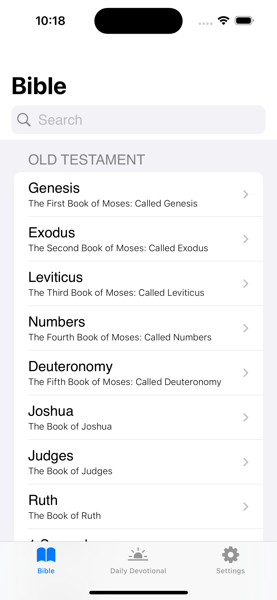
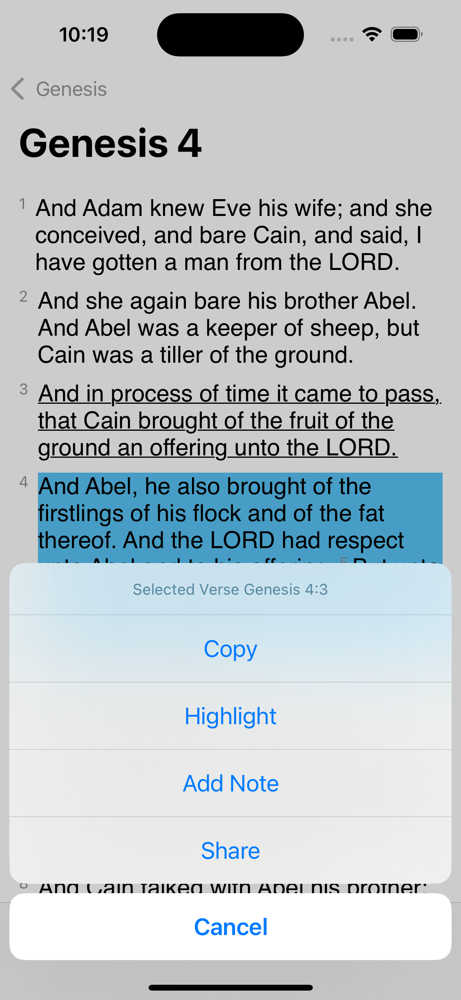
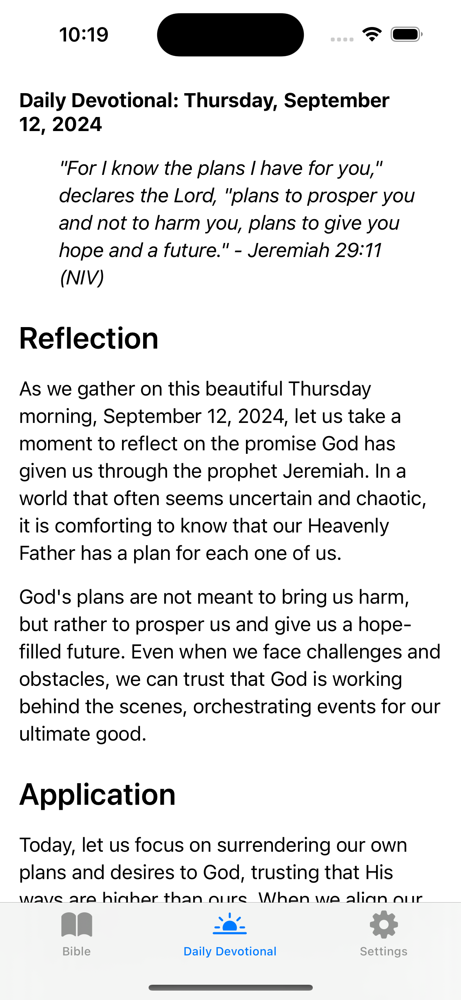
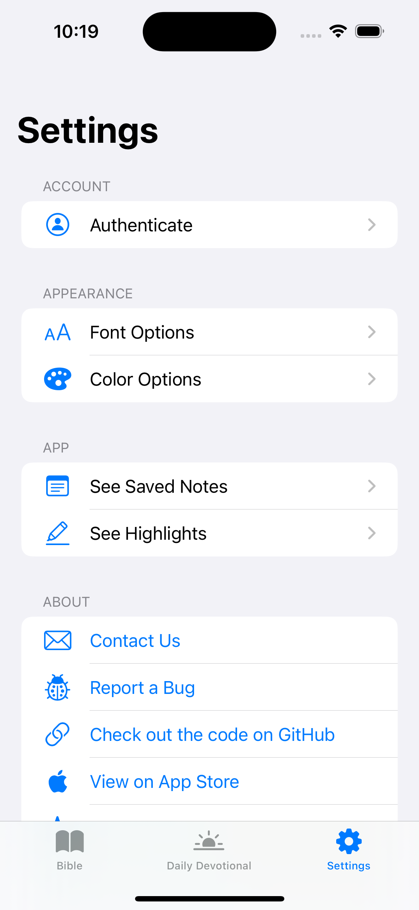

<!-- PROJECT LOGO -->
<br />
<p align="center">
  <a href="https://github.com/vanities/swiftbible">
    
  </a>

  <h3 align="center">swiftbible</h3>

  <p align="center">
    open source kingjames version bible
    <br />
  </p>
</p>

SwiftBible is an iOS application that provides users with the King James Version (KJV) of the Bible, beautifully designed and developed using the SwiftUI framework. The app allows users to easily access and read the sacred texts, enabling them to deepen their understanding of the scriptures and strengthen their faith.

## Screenshots

     

## Testing

Use this link to download the latest on the AppStore: <https://apps.apple.com/us/app/swiftbible/id6670373108>
Use this link to join the TestFlight: <https://testflight.apple.com/join/MHYwBxpQ>

## Features

- Elegant and intuitive user interface designed with SwiftUI
- Complete King James Version (KJV) of the Bible, including both the Old and New Testaments
- Light and dark mode support to suit your reading preferences
- Easy navigation between books, chapters, and verses
- Daily devotionals, written by Hermes 405B
- Adjustable font size for improved readability
- Highlight and copy verses
- Add notes to your favorite verses and able to quick access them
- Share verses with friends and family via social media, email, or text messages

## Upcoming Features

- Search functionality to quickly find specific passages or keywords
- Chapter and verse titles

## Requirements

- iOS 18.0 or later
- Xcode 16 or later
- Swift 5 or later

## Installation

1. Clone the repository:

   ```bash
   git clone https://github.com/vanities/swiftbible.git
   ```

2. Open the project in Xcode:

   ```bash
   cd swiftbible
   xed .
   ```

3. Build and run the app on the simulator or your iOS device.

## Usage

Upon launching the app, users will be greeted with a list of books from the Bible. Selecting a book will display its chapters, and selecting a chapter will show the corresponding verses. Users can navigate between books, chapters, and verses using the provided navigation controls.

To search for a specific passage or keyword, tap the search icon and enter the desired text. The app will display a list of matching results, which can be tapped to view the relevant verses.

Adjust the font size by tapping the settings icon and selecting the desired font size. The app will automatically update the text size throughout the application.

Bookmark your favorite verses by tapping the bookmark icon next to the verse. To view your bookmarks, tap the bookmarks icon in the main menu.

Share verses with others by tapping the share icon next to the verse, then selecting your preferred sharing method (social media, email, or text message).

## Contributing

We welcome contributions to the SwiftBible project. If you would like to contribute, please fork the repository and submit a pull request with your changes.

## License

SwiftBible is released under the [MIT License](LICENSE).
